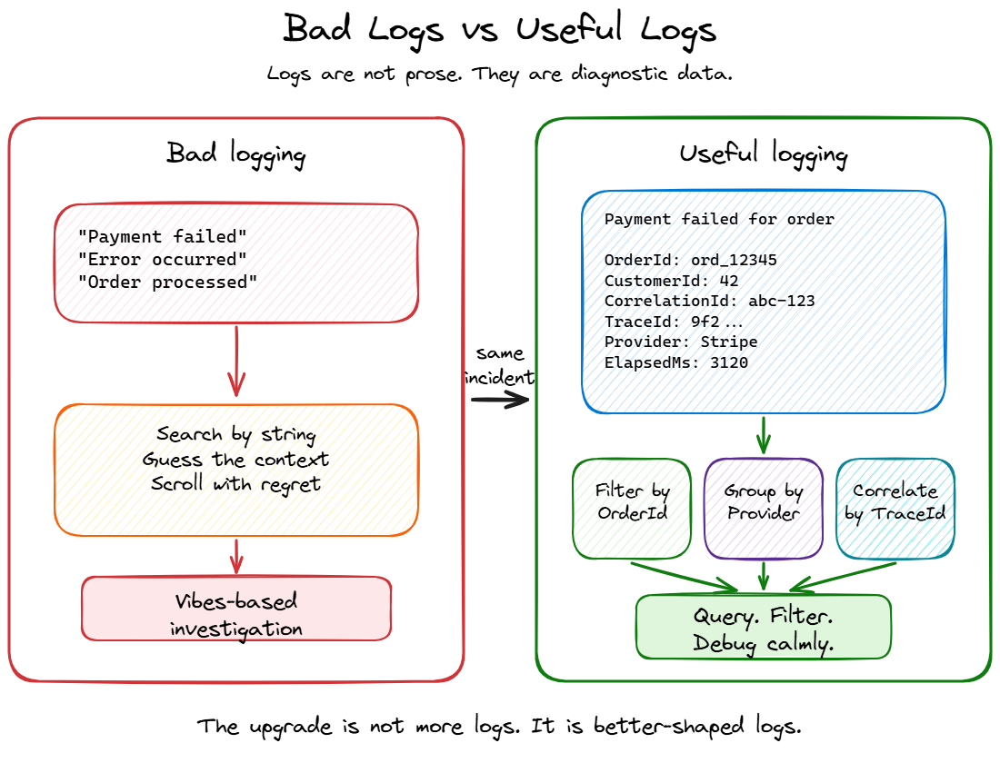
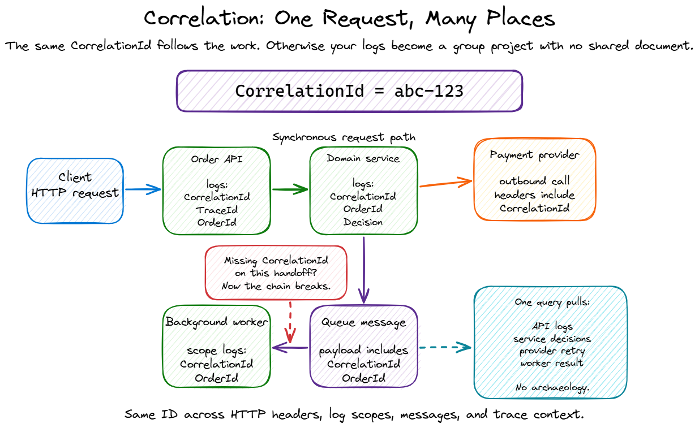

This is the first post in a series called **Observability for Backend Engineers Who Don't Want Dashboard Theater**. The series covers observability the way it actually matters in real backend systems — practical, opinionated, and grounded in production experience rather than vendor marketing.

In this chapter, we are talking about logs. Specifically, why most of them are useless, and what to do about it.

## Table of contents

## The problem with most logs

If I asked you to debug a production issue right now, and the only thing you had was your application's logs, how confident would you be?

For most backend services I have worked on, the honest answer is "not very." The logs exist. There are plenty of them. But when something actually goes wrong, they tend to be either too noisy to find anything useful, or too vague to tell you what actually happened.

This is not a tooling problem. Most teams have perfectly fine logging infrastructure. They have Seq, or Application Insights, or an ELK stack, or whatever their ops team set up three years ago. The problem is what goes into the logs in the first place.

A typical backend service ends up with logs that fall into a few familiar patterns:

- **The "I was here" log.** `"Entering method ProcessOrder"`. Cool. What order? What state was it in? Who called this?
- **The "something happened" log.** `"Order processed successfully"`. Which order? How long did it take? Was anything unusual about it?
- **The "cry for help" log.** `"Error occurred"`. That is the entire message. No exception details, no context, no correlation to anything.
- **The "novel" log.** Fourteen lines of serialised request and response bodies on every single HTTP call, including health checks. Your log storage bill sends its regards.

None of these are helpful when you are debugging a production issue at 2 AM. They are the logging equivalent of someone describing a car crash as "a thing happened on a road."

## How logs lie

Bad logs are not just useless. Sometimes they are actively misleading, which is much worse because now you are debugging with confidence. Always a dangerous combination.

A log line that says `"Order processed successfully"` sounds reassuring until you realise it was written before the database transaction committed. The order was not processed. The log was just optimistic. Production systems, unfortunately, do not run on optimism.

The same thing happens when code logs `"Payment failed"` during a retry flow, and the fifth retry succeeds. Someone searching the logs later sees the error and assumes the customer was not charged. The system did the right thing, but the logs left behind a tiny crime scene.

Or consider this classic:

```cs
try
{
    await ProcessOrderAsync(orderId);
}
catch (Exception ex)
{
    _logger.LogError(ex, "Failed to process order {OrderId}", orderId);
}
```

If the exception is swallowed and the caller still gets a successful response, the log says failure while the API says success. Congratulations, you now have two sources of truth, and one of them is lying.

Logs also lie through severity. A customer entering an invalid email address is not an application error. That is validation doing its job. If every expected user mistake shows up as an error, your error logs stop being an error signal and become customer support fan fiction.

Good logs should describe what actually happened, at the right point in the workflow, with the right severity and context. Anything else is just storytelling with timestamps.

## Structured logging is not optional anymore

The single biggest improvement you can make to your logs is to stop treating them as strings.

Unstructured logs look like this:

```cs
_logger.LogInformation($"Processing order {orderId} for customer {customerId}, amount: {amount}");
```

That produces a perfectly readable line in a console. It is also nearly useless at scale, because you cannot query it. Want to find all log entries for a specific customer? You are now doing string searches across millions of log lines. Want to correlate order processing times? Good luck parsing that out of a sentence.

Structured logging means treating log entries as data, not prose:

```cs
_logger.LogInformation(
    "Processing order {OrderId} for customer {CustomerId}, amount: {Amount}",
    orderId, customerId, amount);
```

The difference looks small, but it is enormous. With structured logging, each log entry becomes a record with named, queryable fields. `OrderId`, `CustomerId`, and `Amount` are now first-class properties you can filter, aggregate, and correlate.



This is where the difference shows up during an incident. With the interpolated string version, you end up doing something like this:

```kusto
traces
| where message contains "customer 42"
| where message contains "Payment failed"
```

That might work, but it is basically the [streetlight effect](https://en.wikipedia.org/wiki/Streetlight_effect) in query form: searching where the light is better, not where the answer is more likely to be. Maybe the message said `CustomerId: 42`. Maybe it said `customer=42`. Maybe someone rewrote it last sprint because the sentence "felt nicer." Your query is now a vibes-based investigation.

With structured logs, the same question becomes boring, which is exactly what you want during an outage:

```kusto
traces
| where customDimensions.CustomerId == "42"
| where message contains "Failed to process payment"
| summarize Count = count() by tostring(customDimensions.Provider)
```

Or:

```kusto
traces
| where customDimensions.OrderId == "ord_12345"
| order by timestamp asc
```

Depending on your sink, those structured properties may show up as top-level fields, nested fields, or under something like `customDimensions` in Application Insights. The point is not the exact query language. Seq, Application Insights, Elasticsearch, Grafana Loki, and whatever your company lovingly assembled from spare YAML all have their own flavour. The important part is that fields let you ask precise questions. Strings make you negotiate with prose.

One thing that matters more than people expect is naming those fields consistently. Pick boring names and reuse them everywhere. If one part of the code logs `OrderId`, another logs `order_id`, another logs `OrderID`, and another logs `Id` because "it was obvious in context", your logging schema slowly turns into a junk drawer with indexes.

This gets painful fast. You start with one useful field and end up with five hundred columns that look like they are cousins but refuse to sit together at family events. Decide on names like `OrderId`, `CustomerId`, `TenantId`, `CorrelationId`, `Provider`, and `ElapsedMs`, then be stubborn about them. Future you will not send flowers, but they may quietly avoid cursing your name during an incident.

:::info
If you are using string interpolation (`$"..."`) in your log calls, you are doing it wrong. The message template with placeholders is what makes structured logging work — it lets the logging framework capture the values as separate fields rather than baking them into a string.
:::

In C#, the most common way to get structured logging right is through [Serilog](https://serilog.net/). The built-in `ILogger` in ASP.NET Core supports message templates, but Serilog gives you richer sinks, better enrichers, and more control over the output format.

:::info[This is not a Serilog ad]
The rest of this post uses Serilog because it is a common and very capable choice in the .NET ecosystem. The ideas are not Serilog-specific. Structured fields, correlation, sensible log levels, and avoiding sensitive data are useful whether you use Serilog, the built-in `ILogger`, OpenTelemetry logging, Application Insights directly, or some internal logging wrapper that has survived three platform migrations.
:::

A basic Serilog setup looks like this:

```cs file="Program.cs"
builder.Host.UseSerilog((context, configuration) =>
{
    configuration
        .ReadFrom.Configuration(context.Configuration)
        .Enrich.FromLogContext()
        .Enrich.WithProperty("Application", "OrderService")
        .WriteTo.Console()
        .WriteTo.Seq("http://localhost:5341");
});
```

Once you have this in place, every log entry automatically carries structured data, and you can push it to a sink that actually lets you query it.

## What to actually log

Having structured logging in place is the foundation, but it only helps if you are logging the right things. And "the right things" is a much smaller list than most people think.

Here is what I think is worth logging in a backend service:

### Request boundaries

Log when a meaningful operation starts and ends. Not every method call — just the entry points that matter: incoming API requests, background job executions, message handler invocations.

```cs
_logger.LogInformation("Handling request {Method} {Path}", request.Method, request.Path);

// ... after processing

_logger.LogInformation(
    "Completed request {Method} {Path} with {StatusCode} in {ElapsedMs}ms",
    request.Method, request.Path, response.StatusCode, elapsed.TotalMilliseconds);
```

:::info[Tip]
ASP.NET Core already logs request start and completion if you enable the right log levels. Before adding your own, check if the framework is already doing it for you. Serilog's `UseSerilogRequestLogging()` middleware gives you a single structured log entry per request with timing, status code, & path and often that is all you need.
:::

### State transitions

When something changes state in a way that matters, log it. An order moving from `Pending` to `Confirmed`. A payment being retried. A feature flag being toggled. These are the events you will actually search for during an incident.

```cs
_logger.LogInformation(
    "Order {OrderId} transitioned from {FromStatus} to {ToStatus}",
    order.Id, previousStatus, order.Status);
```

### Decisions and branches

When your code takes a non-obvious path, log why. This is especially useful for conditional logic that depends on configuration, feature flags, or external state.

```cs
_logger.LogInformation(
    "Skipping notification for order {OrderId}: customer {CustomerId} has notifications disabled",
    orderId, customerId);
```

Six months from now, when someone asks "why didn't the customer get notified?", this log line saves you an hour of debugging.

### Dependency failures and retries

Backend systems rarely fail alone. They fail in groups, like badly coordinated theatre. Your service calls a payment provider, the provider times out, your retry policy kicks in, the third attempt succeeds, and the only log line says `Payment failed`. Helpful in the same way a receipt that says "stuff happened" is accounting.

You do not need to log every successful outbound call. That is usually metric territory. But you should log dependency failures, timeouts, retries, fallbacks, circuit breaker state changes, and queue publish failures. These are the moments that explain why a request took twelve seconds or why the system behaved differently than expected.

```cs
_logger.LogWarning(
    "Retrying payment provider call for order {OrderId}, provider {Provider}, attempt {Attempt}, reason {Reason}",
    orderId, paymentProvider, attempt, reason);
```

The important part is the context. Which dependency? Which operation? Which attempt? What reason? A retry without those details is just the system whispering "something dramatic happened" and then walking away.

### Errors with context

When something fails, log the error along with enough context to actually understand what was happening. The exception alone is rarely enough.

```cs
_logger.LogError(
    ex,
    "Failed to process payment for order {OrderId}, customer {CustomerId}, amount {Amount}, provider {Provider}",
    orderId, customerId, amount, paymentProvider);
```

Compare that with `_logger.LogError(ex, "Payment failed")`. Same exception, completely different debuggability.

:::warning[Please do not stringify exceptions]
Pass the exception as the exception argument. Do not stuff it into a log property and hope the logging framework enjoys arts and crafts.

```cs
// Bad
_logger.LogError("Payment failed: {Exception}", ex);

// Good
_logger.LogError(ex, "Payment failed for order {OrderId}", orderId);
```

The logging framework knows how to capture exception type, message, stack trace, and inner exceptions when you pass it correctly. Let it do its job.
:::

## What to stop logging

This section might be more important than the previous one. The biggest problem with most logging setups is not missing logs — it is too many useless ones drowning out the signal.

### Health checks

If your service has a health check endpoint that gets hit every ten seconds by a load balancer, and you are logging every single one of those requests, you are generating thousands of log entries per hour that will never help anyone.

```cs
// In your Serilog request logging config
app.UseSerilogRequestLogging(options =>
{
    options.GetLevel = (httpContext, elapsed, ex) =>
    {
        if (httpContext.Request.Path.StartsWithSegments("/health"))
            return LogEventLevel.Verbose; // below the production minimum level, so it is not written

        return LogEventLevel.Information;
    };
});
```

### Successful routine operations

Not everything needs a log line. If your message consumer processes ten thousand messages an hour and each one produces three log lines, you are writing thirty thousand log entries for operations that worked perfectly. Log the failures and anomalies. For the happy path, aggregate metrics are usually more useful.

### Request and response bodies

Logging full HTTP request and response payloads is tempting during development and extremely expensive in production. It bloats your log storage, can leak sensitive data, and almost never helps with real debugging because the issue is usually somewhere else entirely.

If you need to debug specific requests, use targeted diagnostic logging that you can turn on temporarily — not blanket body logging on every call.

### Secrets, tokens, and personal data

Some things should not be in logs at all. Not at `Information`, not at `Debug`, not "temporarily", not "just until we fix this one thing." Logs have a habit of living longer than anyone expects, usually in more places than anyone remembers.

Do not log passwords, access tokens, refresh tokens, API keys, cookies, connection strings, full request headers, payment details, or personal data you do not absolutely need for debugging. If your incident response requires grepping production logs and accidentally finding credentials, the logs are no longer helping. They are participating.

Be especially careful with object destructuring:

```cs
_logger.LogInformation("Created order {@Order}", order);
```

That can be useful in controlled situations, but it also means you are logging whatever the object contains today, and whatever someone adds to it six months from now. That is how a harmless log line quietly becomes a credential distribution system with timestamps.

Log the identifiers and fields you actually need. Leave the rest in the database where it belongs.

### Framework noise

EF Core at `Debug` level will log every single SQL query, including parameter values. The HTTP client factory will log every outbound request lifecycle. The DI container will log every service resolution. These are useful during development. In production, they are noise. Set sensible minimum log levels:

```json file="appsettings.Production.json"
{
  "Serilog": {
    "MinimumLevel": {
      "Default": "Information",
      "Override": {
        "Microsoft.AspNetCore": "Warning",
        "Microsoft.EntityFrameworkCore": "Warning",
        "System.Net.Http.HttpClient": "Warning"
      }
    }
  }
}
```

## Correlation: tying logs together

Individual log entries are useful. Correlated log entries are powerful.

When a request comes in and touches three services, hits a database, publishes a message, and returns a response, you want to be able to pull one string and see everything that happened as part of that operation.



In ASP.NET Core, you get some of this for free through `Activity` and the built-in trace/span ID propagation. But in practice, you usually want to enrich your logs with a few more things:

```cs
app.UseSerilogRequestLogging(options =>
{
    options.EnrichDiagnosticContext = (diagnosticContext, httpContext) =>
    {
        var correlationId =
            httpContext.Request.Headers["X-Correlation-Id"].FirstOrDefault()
            ?? httpContext.TraceIdentifier;

        diagnosticContext.Set("CorrelationId", correlationId);
        diagnosticContext.Set("RequestId", httpContext.TraceIdentifier);
        diagnosticContext.Set("TraceId", Activity.Current?.TraceId.ToString());
        diagnosticContext.Set("SpanId", Activity.Current?.SpanId.ToString());
        diagnosticContext.Set("UserId", httpContext.User.FindFirst("sub")?.Value);
        diagnosticContext.Set("TenantId", httpContext.Request.Headers["X-Tenant-Id"].FirstOrDefault());
    };
});
```

Enrich with identifiers that help debugging, but be deliberate about what counts as personal or sensitive data in your system. "It helped me debug once" is not a retention policy, no matter how compelling it sounds during the incident.

For background jobs and message handlers — where there is no HTTP request — you need to establish correlation yourself:

```cs
public async Task HandleAsync(OrderCreatedEvent message, CancellationToken ct)
{
    using (_logger.BeginScope(new Dictionary<string, object?>
    {
        ["CorrelationId"] = message.CorrelationId,
        ["OrderId"] = message.OrderId
    }))
    {
        _logger.LogInformation("Processing OrderCreated event for {OrderId}", message.OrderId);
        // ... handler logic
    }
}
```

The `BeginScope` pattern in `ILogger` (and Serilog's `LogContext.PushProperty`) lets you attach properties to every log entry within a scope. This is how you make it possible to query "show me everything that happened for correlation ID X" and actually get a complete picture.

:::warning
Correlation only works if you propagate the correlation ID across boundaries. If your service publishes a message, the correlation ID needs to be in the message. If it makes an HTTP call, it needs to be in the headers. One broken link in the chain and you lose visibility for everything downstream.
:::

:::info[Where OpenTelemetry fits]
OpenTelemetry matters here because logs, metrics, and traces should not behave like three strangers who happened to witness the same outage. Even if you keep Serilog as your primary logging setup, carrying trace IDs and span IDs through your logs makes it much easier to jump from "this request failed" to "this is everything that happened around it."

ASP.NET Core already has a useful starting point here: when an `Activity` is active, `ILogger` can include trace and span context in log entries. That shared context is what lets a log line connect back to the trace that produced it, instead of floating around production like a mysterious note in a bottle.

There is a much deeper conversation hiding here around OpenTelemetry, `Activity`, exporters, and how logs connect with metrics and traces. We will come back to that later in the series. For now, the important idea is simple: logs should not be isolated text lines. They should participate in the same correlation story as the rest of your observability data.
:::

## Log levels: mean what you say

Log levels seem straightforward, but in practice most codebases use them inconsistently. Here is how I think about them:

| Level         | When to use it                                                                                         |
| ------------- | ------------------------------------------------------------------------------------------------------ |
| `Trace`       | You are debugging something specific and will turn this off after                                      |
| `Debug`       | Useful during development, not in production                                                           |
| `Information` | Something happened that is expected and worth recording                                                |
| `Warning`     | Something unusual happened that might need attention, but the operation continued                      |
| `Error`       | Something failed and the operation could not complete                                                  |
| `Critical`    | The application itself is in trouble — cannot connect to the database, out of memory, startup failures |

The most common mistakes:

- **Logging expected conditions as errors.** A customer entering an invalid email is not an error. It is validation doing its job. Log it as `Information` or `Debug`, not `Error`.
- **Logging everything as Information.** When every message is `Information`, you have no way to filter by severity. You have written a diary, not a diagnostic tool.
- **Never using Warning.** `Warning` is the "this worked, but something was off" level. It is incredibly useful for catching degradation before it becomes an outage. Use it.

## A skeleton for good logging in a new service

If you are starting a new ASP.NET Core service today, here is a reasonable baseline:

:::info[Packages used in this example]
For the Serilog version below, the packages are the usual suspects: `Serilog.AspNetCore`, `Serilog.Sinks.Console`, `Serilog.Sinks.Seq`, and `Serilog.Formatting.Compact` if you want compact JSON output. That is not a shopping list, just enough context so the sample does not look like it arrived fully formed from a conference demo.
:::

```cs file="Program.cs"
var builder = WebApplication.CreateBuilder(args);

// Structured logging with Serilog
builder.Host.UseSerilog((context, configuration) =>
{
    configuration
        .ReadFrom.Configuration(context.Configuration)
        .Enrich.FromLogContext()
        .Enrich.WithProperty("Application", "MyService")
        .Enrich.WithProperty("Environment", context.HostingEnvironment.EnvironmentName)
        .WriteTo.Console(new RenderedCompactJsonFormatter())
        .WriteTo.Seq(context.Configuration["Seq:Url"] ?? "http://localhost:5341");
});

var app = builder.Build();

// Request logging — single entry per request, with enrichment
app.UseSerilogRequestLogging(options =>
{
    options.EnrichDiagnosticContext = (diagnosticContext, httpContext) =>
    {
        diagnosticContext.Set("RequestId", httpContext.TraceIdentifier);
        diagnosticContext.Set("UserId", httpContext.User.FindFirst("sub")?.Value);
    };

    options.GetLevel = (httpContext, elapsed, ex) =>
    {
        if (httpContext.Request.Path.StartsWithSegments("/health"))
            return LogEventLevel.Verbose; // below the production minimum level, so it is not written
        if (ex != null || httpContext.Response.StatusCode >= 500)
            return LogEventLevel.Error;
        if (elapsed > 3000)
            return LogEventLevel.Warning;

        return LogEventLevel.Information;
    };
});

app.MapGet("/health", () => Results.Ok());

// ... your endpoints

app.Run();
```

```json file="appsettings.Production.json"
{
  "Serilog": {
    "MinimumLevel": {
      "Default": "Information",
      "Override": {
        "Microsoft.AspNetCore": "Warning",
        "Microsoft.EntityFrameworkCore": "Warning",
        "System.Net.Http.HttpClient": "Warning"
      }
    }
  }
}
```

That gets you structured output, request-level logging with timing and status, correlation support, and sensible noise reduction. You can add more enrichment as your service grows, but this is a solid starting point.

## Wrapping up

Logging is the most accessible part of observability. Every framework supports it, every service already does some of it, and it requires zero additional infrastructure beyond what most teams already have. But accessibility has a downside — because it is easy to add a log line, most codebases end up with too many bad ones instead of fewer good ones.

The short version:

- **Structure your logs.** Message templates, not string interpolation. Queryable fields, not prose.
- **Log meaningful events.** Request boundaries, state transitions, decisions, errors with context.
- **Stop logging noise.** Health checks, routine successes, request bodies, framework internals at debug level.
- **Correlate everything.** Thread a correlation ID through requests, messages, and background jobs.
- **Use log levels honestly.** They are a severity signal, not a volume knob.

Get these basics right, and your logs become a tool you actually reach for during incidents rather than something you scroll through hopelessly while muttering "why would anyone write this" at a person who may have been you six months ago.

In the next post, we will talk about **metrics** — because logs can tell you what happened to one request, but they are a terrible way to understand how the whole system is behaving. Also, "it feels slow" is not an SLO, no matter how confidently someone says it in standup.

:::info[Observability series]
This post is part of **Observability for Backend Engineers Who Don't Want Dashboard Theater** - a series about production visibility that tries very hard not to become a collection of expensive screenshots.

| Part | Post                                                                                  |
| ---- | ------------------------------------------------------------------------------------- |
| 1    | **Your Logs Are Lying to You** ← you are here                                         |
| 2    | [Metrics: Because "It Feels Slow" Isn't an SLO](/blog/posts/observability-02-metrics) |
| 3    | Traces: Following a Request Through the Haunted House _(coming next)_                 |

:::

---

_This is Part 1 of the [Observability for Backend Engineers](/blog/tags/observability-for-backend-engineers) series._
