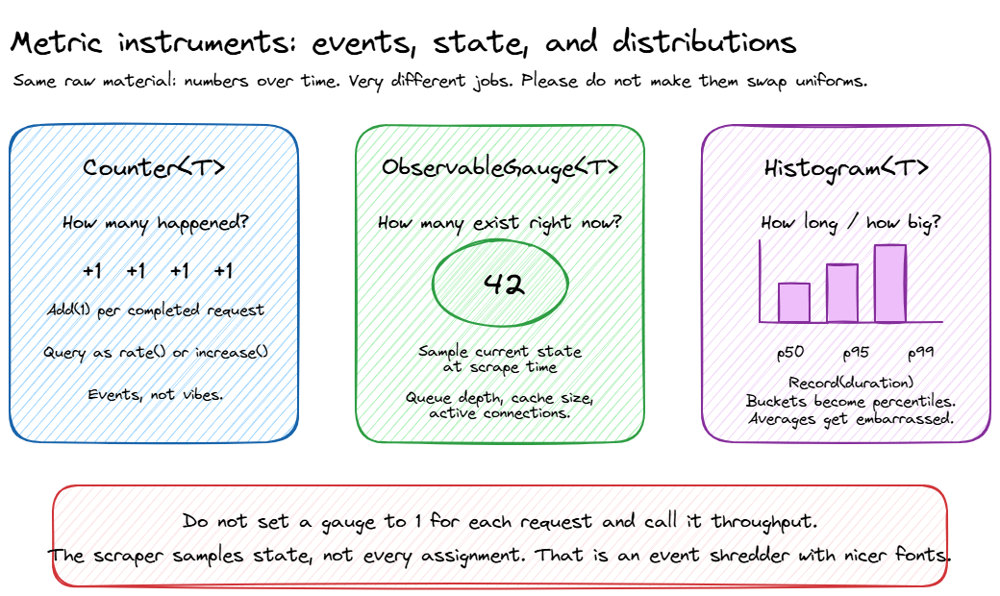

This is Part 2 of the **Observability for Backend Engineers Who Don't Want Dashboard Theater** series. [Part 1 covered logs](/blog/posts/observability-01-logs), with structured logging, correlation, and why `Console.WriteLine("here")` in production is a cry for help.

Now we are talking about metrics. The useful kind, where you can answer "is this thing healthy?" without opening three dashboards, grepping logs, and performing a small ritual.

## Table of contents

## The problem with not having metrics

If someone asked you right now whether your service is healthy, what would you say?

Every backend team has had this meeting. Someone important says "the app feels slow." The team scrambles. Someone greps the logs for slow requests. Someone else eyeballs response times in a few cherry-picked traces. A third person says "it seems fine to me" and opens a dashboard that has not been updated since 2023.

Nobody can answer the basic questions: slow compared to what? Since when? For which endpoints? For what percentage of users?

This is the gap that metrics fill. Logs are individual event records, great for post-incident forensics. Metrics are aggregated measurements over time. They answer questions about the system as a whole, not about one specific request.

Without metrics, answering "what is our p99 latency for order creation since the deploy?" turns into archaeology. You grep logs, parse timestamps, remember that one code path logs milliseconds while another logs seconds, and eventually produce a spreadsheet with the structural integrity of wet cardboard.

With metrics, the same question is boring:

```txt file="PromQL"
histogram_quantile(
  0.99,
  sum by (le) (
    rate(http_server_request_duration_seconds_bucket{http_route="/api/orders"}[5m])
  )
)
```

Boring is good. Boring means the answer does not depend on who remembered the right log query.

You do not debug an outage with metrics alone. But you detect one. You scope one. You answer "is this getting worse?" and "did the deploy fix it?" Metrics are the vital signs. Logs are the MRI.

## What even is a metric?

A metric is a named numeric value that you collect over time. That is it. Request count. Error rate. Queue depth. Response time. CPU usage. Each one is a number, attached to a name, sampled or incremented at regular intervals.

What makes metrics powerful is not individual data points. It is aggregation. You do not care that one request took 247ms. You care that the 99th percentile latency for `/api/orders` went from 200ms to 800ms after last Thursday's deployment.

### Metric types

Most metrics systems give you three fundamental instrument types:

| Type          | What it does                                             | Example                                                |
| ------------- | -------------------------------------------------------- | ------------------------------------------------------ |
| **Counter**   | Goes up. Only up. Monotonically increasing.              | Total requests served, total errors, total bytes sent  |
| **Gauge**     | Goes up or down. A point-in-time measurement.            | Current queue depth, active connections, CPU usage     |
| **Histogram** | Records a distribution of values. Gives you percentiles. | Request duration, response size, batch processing time |

Counters are usually consumed as rates. "Requests per second" is more useful than "we have served 14 million requests since the process started." Gauges are snapshots. Histograms are where the interesting stuff lives, because averages lie and percentiles don't (as much).



:::info[Counter vs gauge mental model]
A counter records events. A gauge records current state.

For "number of requests processed", use a counter and add `1` when a request completes. The raw value usually means "this process has handled N requests since it started", which is mostly uptime trivia. It becomes useful when you query it over a time window: requests per second, errors in the last 5 minutes, payments processed today, failed requests divided by total requests.

Do not use a gauge as a fake counter by setting it to `1` every time a request is processed. A metrics backend does not see every assignment. It samples the current value when it scrapes. If 500 requests happen between scrapes and each one sets the gauge to `1`, the backend still sees `1`. Congratulations, you built a very efficient event shredder.

Use a counter for "how many happened?" Use a gauge for "how many exist right now?" Use an up/down counter when your code naturally sees both sides of the lifecycle, like active jobs starting and finishing.
:::

### Percentiles, averages, and why averages lie

If your service has a p50 latency of 100ms and a p99 of 5 seconds, the average will tell you everything is fine. The average is wrong.

Averages smooth out the distribution. A request that takes 100ms and a request that takes 10 seconds average to 5.05 seconds, which describes neither experience accurately. This is why you need histograms, not averages.

The metrics that matter for latency:

- **p50 (median):** what the typical user experiences
- **p95:** what the unlucky user experiences
- **p99:** what the really unlucky user experiences. At scale, 1% of 10 million requests is 100,000 bad experiences.

When someone says "our latency is 200ms," always ask "which percentile?" If the answer is "average" or "I don't know," the number is meaningless.

:::warning[Average-only dashboards are vibes]
If your monitoring dashboard shows only average latency, it is a dashboard designed to make you feel good, not one designed to help you find problems. Replace it with p50/p95/p99 as soon as possible.
:::

Histogram buckets matter too. If your buckets are `100ms`, `1s`, and `10s`, you will know that something is slow, but not whether it is annoyingly slow or "the customer has opened another tab and is reconsidering their life choices" slow. Pick buckets that match your actual expectations for the endpoint.

### Dimensions and labels

A metric name alone is not enough. `http_request_duration` is useful. `http_request_duration` broken down by `method`, `endpoint`, and `status_code` is powerful. Those breakdowns are called dimensions, labels, or tags depending on which metrics system you are using. They all mean the same thing: key-value pairs attached to a metric that let you filter and group.

But there is a trap here, and it has ruined more Prometheus instances than bad configuration files ever have.

:::warning[The cardinality trap]
Every unique combination of label values creates a separate time series. Labels are how metrics become useful, and also how metrics backends become expensive furniture.

Good labels: `method`, `endpoint`, `status_code`, `service`, `region`.

Bad labels: `userId`, `requestId`, `orderId`, `sessionToken`, anything that is unique per request.

We will come back to this properly in the field guide below, because cardinality deserves its own little crime scene.
:::

## RED, USE, and the Four Golden Signals

There are three well-known frameworks for deciding what to measure. They overlap significantly, but each has a slightly different focus.

### RED Method

Created by [Tom Wilkie](https://grafana.com/blog/the-red-method-how-to-instrument-your-services/), the RED Method is designed for services, the things your team writes and deploys:

- **Rate:** requests per second
- **Errors:** the number of those requests that are failing
- **Duration:** how long those requests take, as a distribution, not an average

This is the starting point for any backend service. If you can answer "how many requests are we handling, how many are failing, and how long are they taking?" for every service, you are already ahead of most teams.

### USE Method

Created by [Brendan Gregg](https://www.brendangregg.com/usemethod.html), the USE Method is designed for resources, the infrastructure your services run on:

- **Utilization:** percentage of time the resource is busy
- **Saturation:** the amount of work the resource cannot yet service, such as queue length
- **Errors:** error event count

USE is for CPUs, memory, disks, network interfaces. It is less about your application code and more about whether the machine underneath is healthy.

This matters because "the API is slow" and "the disk is saturated" are different problems with very different fixes. One needs application investigation. The other needs you to stop blaming the controller action while the storage layer quietly melts in the corner.

### The Four Golden Signals

From Google's [SRE Book](https://sre.google/sre-book/monitoring-distributed-systems/), the Four Golden Signals are essentially RED plus saturation:

- **Latency:** time to serve a request, with successful and failed requests measured separately
- **Traffic:** demand on your system, usually requests per second
- **Errors:** rate of failed requests
- **Saturation:** how "full" your service is, such as CPU quota usage, memory pressure, or queue backlog

### Which one should you use?

All of them, kind of. Start with RED for your application services. Add USE for your infrastructure. Congratulations, you have covered the Four Golden Signals without needing to memorise a fourth acronym.

The framework matters less than the habit. Pick a systematic way to decide what to measure, instead of the default strategy of "add a metric whenever someone panics during an incident."

## Metrics in .NET: System.Diagnostics.Metrics

.NET has had several metrics APIs over the years. `PerformanceCounter` is ancient. `EventCounters` were the .NET Core era approach. The modern answer is `System.Diagnostics.Metrics`, introduced in .NET 6 and aligned with OpenTelemetry's instrumentation model. In .NET 8, `IMeterFactory` made this cleaner to use with dependency injection, and as of .NET 10 that is still the recommended shape for application code.

The shape is simple: create a `Meter` (a named group of instruments), then create instruments on it (counters, histograms, gauges). Instruments record measurements. Something downstream, such as Prometheus, OTLP, or `dotnet-counters`, collects and exports them.

The instruments you will use most often are:

| Instrument           | Use it for                                 | Example                                          |
| -------------------- | ------------------------------------------ | ------------------------------------------------ |
| `Counter<T>`         | Values that only increase                  | Orders created, HTTP requests, failed payments   |
| `Histogram<T>`       | Distributions                              | Request duration, response size, processing time |
| `UpDownCounter<T>`   | Values that can both increase and decrease | Active jobs, in-flight requests                  |
| `ObservableGauge<T>` | Values observed from current state         | Queue depth, cache size, memory pressure         |

Most services only need a few custom instruments. If your metrics class has more properties than your domain model, you may have mistaken observability for inventory management.

`ObservableGauge<T>` is the odd one out because you do not record values directly. You give .NET a callback, and the metrics pipeline observes the current value when it collects:

```cs
meter.CreateObservableGauge(
    "orders.queue.depth",
    () => queue.Count,
    unit: "{order}",
    description: "Number of orders waiting to be processed");
```

Use this for state that already exists somewhere else, like queue depth or cache size. The callback runs when metrics are collected, so make sure the value you read is thread-safe. `ConcurrentQueue<T>.Count`, an `Interlocked` value, or another safe snapshot are all better than updating a gauge manually with vibes and hope.

### Setting up a Meter

```cs file="Metrics/ServiceMetrics.cs"
using System.Diagnostics.Metrics;

public class ServiceMetrics
{
    public const string MeterName = "MyCompany.OrderService";

    private readonly Counter<long> _ordersCreated;
    private readonly Counter<long> _ordersFailed;
    private readonly Histogram<double> _orderProcessingDuration;
    private readonly UpDownCounter<long> _activeOrders;

    public ServiceMetrics(IMeterFactory meterFactory)
    {
        var meter = meterFactory.Create(MeterName);

        _ordersCreated = meter.CreateCounter<long>(
            "orders.created",
            unit: "{order}",
            description: "Number of orders successfully created");

        _ordersFailed = meter.CreateCounter<long>(
            "orders.failed",
            unit: "{order}",
            description: "Number of orders that failed to create");

        _orderProcessingDuration = meter.CreateHistogram<double>(
            "orders.processing.duration",
            unit: "s",
            description: "Time taken to process an order");

        _activeOrders = meter.CreateUpDownCounter<long>(
            "orders.active",
            unit: "{order}",
            description: "Number of orders currently being processed");
    }

    public void OrderCreated(string region) =>
        _ordersCreated.Add(1, new KeyValuePair<string, object?>("region", region));

    public void OrderFailed(string region, string reason) =>
        _ordersFailed.Add(1,
            new KeyValuePair<string, object?>("region", region),
            new KeyValuePair<string, object?>("failure.reason", reason));

    public void RecordProcessingDuration(double durationSeconds, string region) =>
        _orderProcessingDuration.Record(durationSeconds,
            new KeyValuePair<string, object?>("region", region));

    public void OrderProcessingStarted() => _activeOrders.Add(1);
    public void OrderProcessingCompleted() => _activeOrders.Add(-1);
}
```

```cs file="Program.cs"
// Register your metrics class
builder.Services.AddSingleton<ServiceMetrics>();
```

`IMeterFactory` is registered by `builder.Services.AddMetrics()` or by `AddOpenTelemetry().WithMetrics(...)`, which we wire up below. If you copy only this snippet and skip metrics registration, dependency injection will complain, and for once it will be right.

:::info[Why IMeterFactory?]
You could create a `static Meter` and call it a day. It works. But `IMeterFactory` plays nicely with dependency injection, gives you proper lifetime management, and makes your metrics testable. In a `static` Meter world, your unit tests either ignore metrics entirely or fight with shared global state. Neither is fun.
:::

Recording a metric is cheap. The hot path is designed for this. The expensive part is usually what happens later: aggregation, export, storage, and the moment someone adds `customerId` as a label and quietly turns your metrics backend into a bonfire.

### Using metrics in a service

```cs file="Services/OrderService.cs"
using System.Diagnostics;

public class OrderService
{
    private readonly ServiceMetrics _metrics;
    private readonly ILogger<OrderService> _logger;

    public OrderService(ServiceMetrics metrics, ILogger<OrderService> logger)
    {
        _metrics = metrics;
        _logger = logger;
    }

    public async Task<Order> CreateOrderAsync(CreateOrderRequest request)
    {
        _metrics.OrderProcessingStarted();
        var stopwatch = Stopwatch.StartNew();

        try
        {
            var order = await ProcessOrderInternal(request);

            stopwatch.Stop();
            _metrics.OrderCreated(request.Region);
            _metrics.RecordProcessingDuration(stopwatch.Elapsed.TotalSeconds, request.Region);

            return order;
        }
        catch (Exception ex)
        {
            _metrics.OrderFailed(request.Region, ex.GetType().Name);
            _logger.LogError(ex, "Failed to create order in region {Region}", request.Region);
            throw;
        }
        finally
        {
            _metrics.OrderProcessingCompleted();
        }
    }
}
```

### Naming conventions

Follow the [OpenTelemetry semantic conventions](https://opentelemetry.io/docs/specs/semconv/general/metrics/) for naming:

- Lowercase, dotted hierarchy: `orders.created`, not `OrdersCreated` or `orders_created`
- Use `.` as namespace separator and `_` to separate words within a segment
- Include units in the instrument definition, not in the name: `orders.processing.duration` with `unit: "s"`, not `orders.processing.duration_seconds`
- Meter name should identify the library/component: `MyCompany.OrderService`

:::info[Convention, not physics]
The exact names for your own business metrics are a convention, not a law of nature. Consistency is the part that matters. I prefer OpenTelemetry-style dotted names because they sit nicely beside built-in metrics like `http.server.request.duration`, and the underscore rule handles multi-word segments like `system.cpu.logical_count`.
:::

Boring, consistent naming now saves you from a metrics junk drawer later. Same lesson as structured log field names from Part 1: pick a convention and be stubbornly consistent about it.

## What to actually measure

Here is a practical checklist for a typical backend service:

### The RED basics (measure these first)

- **Request rate** by endpoint and method
- **Error rate** by endpoint and error type. 4xx vs 5xx matters; one is "you asked wrong", the other is "we broke"
- **Request duration** as a histogram, with p50, p95, and p99 at minimum

### Dependency health

- Duration, error rate, and retry count for every outbound dependency (databases, APIs, caches, message brokers)
- Connection pool utilisation (are you running out of database connections before running out of CPU?)
- Circuit breaker state changes

### Async processing (if applicable)

- Queue depth / consumer lag
- Processing rate and duration per message type
- Dead letter queue size. This one should have an alert on it, always

### Business metrics

These are the ones your product manager actually cares about, and the ones most engineering teams forget to instrument:

- Orders created per minute
- Payments processed, failed, retried
- User signups, login failures
- Whatever KPI your team reports on in sprint reviews

Business metrics are underrated. When the CEO asks "are we making money right now?" the answer should not involve someone SSHing into a production box.

### Runtime metrics (mostly free)

ASP.NET Core and the .NET runtime expose a bunch of useful metrics out of the box: GC pause times, thread pool queue length, HTTP connection pool usage. With OpenTelemetry configured, you get many of these without writing a single line of instrumentation code.

Do not start by inventing twenty custom metrics. Start with what the platform already gives you, add RED metrics for your service, then add business metrics for the things your team is actually responsible for. Observability is not a sticker collection.

## How to mess up metrics (a field guide)

Metrics seem simple. Name a number, record it, graph it. And yet, teams find creative ways to make them useless, expensive, or actively misleading. Here is a taxonomy of the most popular mistakes, presented in the spirit of helping you avoid them. Or at least recognising them faster when you inevitably make them anyway.

### The cardinality bomb

We touched on this earlier with the cardinality warning, but it deserves a proper burial here because it is the single most common way to set your metrics backend on fire.

Every unique combination of label values creates a separate time series. A request duration metric with 200 endpoints, 3 regions, and 5 status codes creates 3,000 time series. That is not free, but it is survivable. Add `userId` for 100,000 users and you have 300 million potential time series. Your metrics backend will not send you a thank-you note. It will send you a bill, then fall over.

The insidious part: it works fine for weeks. Then one morning your Prometheus instance OOMs, your Grafana dashboards timeout, and someone discovers that a well-meaning engineer added `correlationId` as a metric tag three sprints ago because "it might be useful for debugging." It was not useful. It was arson.

Rules that will save you:

- If a label value is unique per request, it belongs in a trace or a log. Period.
- If a label can have more than ~200 distinct values, think very hard before adding it.
- If you are not sure, leave it out. You can always add a label later. Removing one after your TSDB has ingested three weeks of high-cardinality data is a different kind of fun.

### Measuring the wrong things

Not every number deserves to be a metric. Some signs you are measuring the wrong things:

**Duplicating what the platform already gives you.** ASP.NET Core emits `http.server.request.duration` out of the box. If you are also manually timing every controller action and recording it to a custom histogram, you now have two sources of truth that will inevitably disagree. Pick one. Preferably the one you did not write.

**Vanity metrics.** "Total registered users" looks impressive on a big-screen dashboard in the office lobby. It tells you nothing about whether the system is healthy _right now_. It goes up every day regardless of whether anything is working. It is a business report wearing an incident-response costume.

**"Just in case" metrics.** Someone adds a counter for every internal method call because "what if we need it someday?" You now have 300 time series that nobody looks at, costing real money in storage, and making the metrics catalog so noisy that finding the useful ones requires its own search engine. Every metric is a maintenance promise. If nobody will ever alert on it, dashboard it, or use it to make a decision, it is not observability. It is hoarding.

**Internal implementation details.** "Number of times we entered the retry loop" is trivia. "Number of retries per dependency" is actionable. The difference is whether the metric helps you understand system behaviour from the outside, or whether it is just narrating the code to itself.

A good metric helps you detect, explain, or decide something. If it does none of those, remove it before it becomes another graph nobody opens but everyone is afraid to delete.

### Metrics that lie to you

This is the sneaky one. You picked the right things to measure, you kept cardinality under control, and your dashboards look professional. But the numbers are still lying. Metrics can mislead you just as effectively as the optimistic logs we talked about in Part 1.

**Summing averages across instances.** You have five instances of your service. Each reports an average latency. You average the averages and get a number that is mathematically meaningless. Averages do not compose. If one instance handled 10,000 requests at 50ms and another handled 100 requests at 5 seconds, the "average of averages" will tell you things are fine. They are not. Use histograms and aggregate the buckets, or compute percentiles from merged distributions.

**Stale gauges from dead pods.** A pod dies. Its last reported gauge value, say a queue depth of 47, sits in your TSDB forever (or until the series expires). Your dashboard shows a queue depth of 47 for a thing that no longer exists. You investigate a phantom backlog, spend twenty minutes confirming the pod is gone, and then quietly question your career choices. Use staleness markers or configure appropriate series expiration.

**Counter resets looking like traffic drops.** Counters reset to zero when a process restarts. If your monitoring tool does not handle resets correctly (Prometheus does, many custom scrapers do not), a deploy looks like traffic dropped to zero for a moment. This is especially fun when combined with alerting. "We got paged because we deployed" is a rite of passage nobody should have to repeat.

**Scrape intervals hiding spikes.** If you scrape every 60 seconds but your CPU hits 100% for 5-second bursts between scrapes, your utilisation graph will show a gentle 15% and you will never know why requests occasionally timeout. This is [Brendan Gregg's burst-averaging problem](https://www.brendangregg.com/usemethod.html). The resolution of your metrics determines what you can see. If your SLO cares about sub-second spikes, your metrics need to be granular enough to catch them.

**Measuring at the wrong boundary.** Recording "order created" before the database transaction commits is the metrics equivalent of celebrating a goal before the ball crosses the line. If the transaction rolls back, your counter says one thing happened and reality says another. Same pattern as the optimistic log from Part 1: measure _after_ the thing actually succeeded, not when you are feeling confident about it.

## Wiring up OpenTelemetry metrics export

`System.Diagnostics.Metrics` records measurements. OpenTelemetry collects and exports them. Wiring the two together in ASP.NET Core:

:::info[Packages used in this example]
The code below assumes you have the relevant OpenTelemetry packages installed:

```bash
dotnet add package OpenTelemetry.Extensions.Hosting
dotnet add package OpenTelemetry.Instrumentation.AspNetCore
dotnet add package OpenTelemetry.Instrumentation.Http
dotnet add package OpenTelemetry.Instrumentation.Runtime
dotnet add package OpenTelemetry.Exporter.OpenTelemetryProtocol
dotnet add package OpenTelemetry.Exporter.Prometheus.AspNetCore
```

OpenTelemetry is a standard, but NuGet packages are still where optimism goes to meet reality.
:::

```cs file="Program.cs"
builder.Services.AddOpenTelemetry()
    .WithMetrics(metrics =>
    {
        metrics
            // Built-in ASP.NET Core metrics
            .AddAspNetCoreInstrumentation()
            // Built-in HTTP client metrics
            .AddHttpClientInstrumentation()
            // Built-in runtime metrics (GC, thread pool, etc.)
            .AddRuntimeInstrumentation()
            // Your custom meters
            .AddMeter(ServiceMetrics.MeterName)
            // Export via OTLP (to Grafana, Jaeger, Azure Monitor, etc.)
            .AddOtlpExporter();
    });
```

For local development, a Prometheus exporter with Grafana is a solid setup:

```cs
// Instead of (or in addition to) OTLP
.AddPrometheusExporter();

// Then expose the /metrics endpoint
app.MapPrometheusScrapingEndpoint();
```

In production, OTLP is usually the least annoying default because it keeps your application from caring where the telemetry eventually lands. Grafana, Azure Monitor, Honeycomb, New Relic, Datadog, and several other tools can receive OTLP directly or through the OpenTelemetry Collector. The collector is where you do routing, filtering, batching, and other plumbing that does not belong in your application code.

:::info[The OTel thread continues]
In Part 1, we mentioned OpenTelemetry as the glue that connects logs, metrics, and traces. Metrics are where that starts to feel useful. `System.Diagnostics.Metrics` is the recording API. OpenTelemetry is the pipeline that gets those measurements to wherever you visualise them. Same pattern as `Activity` for traces, which we will cover in Part 3. .NET provides the API surface, OTel provides the plumbing.
:::

### What meters to enable

Start with these built-in instrumentation sources:

| Source                           | What you get                                                  |
| -------------------------------- | ------------------------------------------------------------- |
| `AddAspNetCoreInstrumentation()` | `http.server.request.duration`, `http.server.active_requests` |
| `AddHttpClientInstrumentation()` | `http.client.request.duration` for outbound HTTP calls        |
| `AddRuntimeInstrumentation()`    | GC collections, heap size, thread pool queue length, etc.     |
| `AddMeter("YourApp.Meter")`      | Your custom business and application metrics                  |

You get a surprising amount of visibility just from enabling the built-in instrumentation. Add your custom meters on top for business-specific signals.

## SLIs and SLOs: metrics that mean something to the business

Metrics become genuinely useful when they are connected to an expectation. That is what SLIs and SLOs give you.

- **SLI (Service Level Indicator):** a metric that quantifies some aspect of service quality. For example: "the proportion of requests to `/api/orders` that complete in under 300ms."
- **SLO (Service Level Objective):** a target for that indicator. For example: "99.5% of requests should complete in under 300ms, measured over a 30-day rolling window."
- **SLA (Service Level Agreement):** an SLO with contractual consequences. If you miss it, someone writes a cheque.

The reason "it feels slow" is not an SLO: there is no baseline, no target, and no way to measure whether things got better or worse. An SLO gives you a number to compare against and a budget to burn. If you are meeting your SLO with room to spare, you can ship riskier changes. If you are close to the edge, slow down.

For an order creation endpoint, a reasonable first pass might be:

| Item         | Example                                                                    |
| ------------ | -------------------------------------------------------------------------- |
| User journey | Customer creates an order                                                  |
| SLI          | Percentage of successful `POST /api/orders` requests completed under 300ms |
| SLO          | 99.5% over a rolling 30-day window                                         |
| Error budget | 0.5% of requests can be slower or fail before you have spent the budget    |

That is much better than "orders should be fast," which is not an objective. It is a wish wearing a blazer.

You do not need SLOs for every metric. Start with one or two for your most critical endpoints and see how it changes the way your team makes decisions.

## Wrapping up

Logs tell you what happened to a specific request. Metrics tell you how the system is doing overall. They are different tools for different questions, and you need both.

The practical takeaway:

- **Use RED for services.** Rate, Errors, Duration. If you measure nothing else, measure these.
- **Use USE for infrastructure.** Utilization, Saturation, Errors. Know if the machine is healthy.
- **Use `System.Diagnostics.Metrics`.** The modern .NET metrics API. Create a `Meter`, create instruments, let OpenTelemetry export them.
- **Histograms over averages.** p50, p95, p99 tell you what is actually happening. Averages tell you a bedtime story.
- **Watch your cardinality.** Every unique label combination is a time series. High-cardinality labels belong in logs and traces, not metrics.
- **Connect metrics to SLOs.** Metrics without targets are numbers without meaning.

In the next post, we will talk about **distributed tracing**: following a request through the haunted house of microservices, why your trace waterfall probably looks like abstract art, and where logs, metrics, and traces finally start sharing context through OpenTelemetry.

:::info[Observability series]
This post is part of **Observability for Backend Engineers Who Don't Want Dashboard Theater**, a series about production visibility that tries very hard not to become a collection of expensive screenshots.

| Part | Post                                                                  |
| ---- | --------------------------------------------------------------------- |
| 1    | [Your Logs Are Lying to You](/blog/posts/observability-01-logs)       |
| 2    | **Metrics: Because "It Feels Slow" Isn't an SLO** ← you are here      |
| 3    | Traces: Following a Request Through the Haunted House _(coming next)_ |

:::

---

_This is Part 2 of the [Observability for Backend Engineers](/blog/tags/observability-for-backend-engineers) series._
